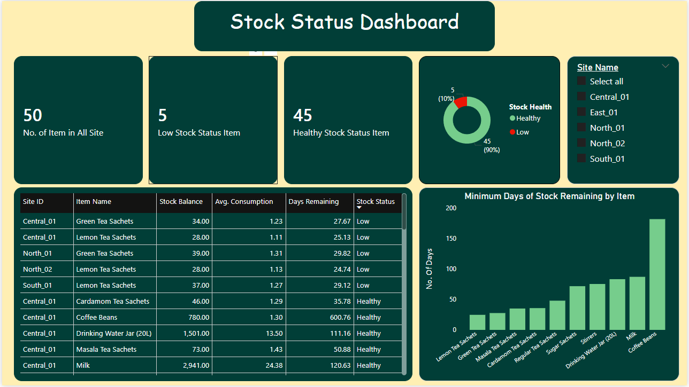
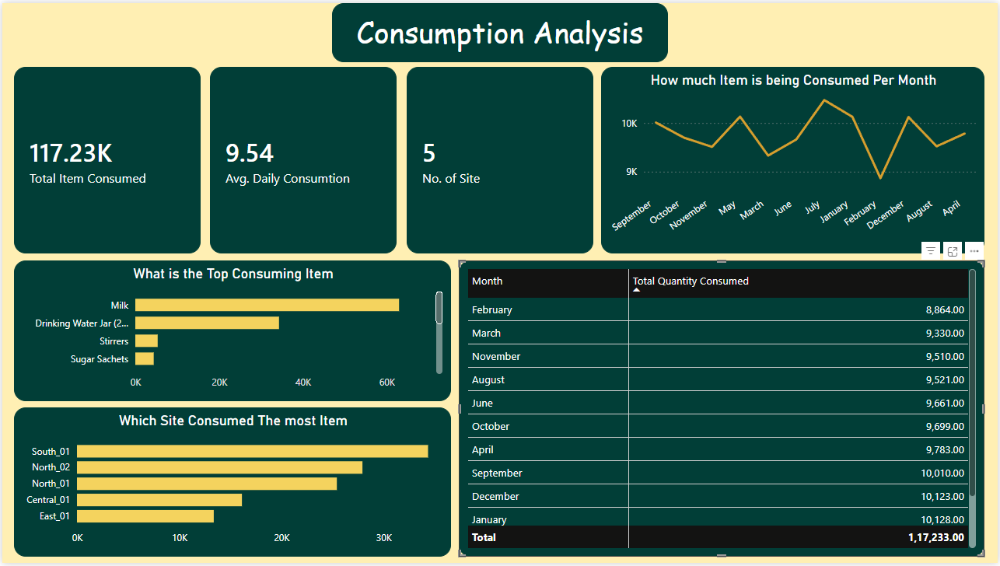
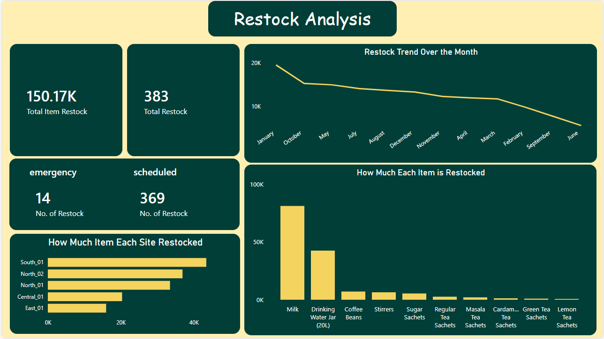

# About this project: 
This project is inspired by the real operational challenges faced by facility management industry, this project builds an end to end inventory analytics solution of restocking problem and can reduce emergency restocks and stock-out with data driven records and analysis.

## 📌 The Problem 
---
Managed office service companies operating across multiple sites face recurring inventory challenges. Consumable items such as Milk, Coffee, Water, Tea, and Sugar are often replenished on a fixed calendar schedule regardless of actual consumption rates. 

Each site serves multiple clients with different headcounts and consumption patterns, while all drawing stock from a shared central storeroom. 

Because restocking is calendar-driven rather than consumption-driven, stock levels are not actively monitored between cycles. High-consumption items like Milk and Water can deplete faster than expected, while low-velocity items accumulate excess stock.

 This leads to: 
 - Emergency restocks 
 - Stock-outs at sites 
 - Inefficient inventory allocation 
 
 This project solves that by building a **consumption-driven inventory monitoring system** using SQL + Python + Power BI.

---

## Dataset
* This data set is synthetically designed to represent real world data and the consumption range is also designed according to the headcount of each client size.
* In this dataset there is 5 sites, 32 clients & 10 items.
* Dataset is designed to represent 1 year worth of data from (Jan-Dec 2025).
* The daily distribution is the biggest tables among all of the tables with around 40000+ rows so that it can represent real world data.
* Intentionally made some data quality issue like Missing value, duplicates, outliers

### Tables:
 - `Sites` 
 - `Clients` 
 - `Items` 
 - `Daily_Usage` 
 - `Site_Stock_Restock` 
 - `Opening_Restock` 
 
 ---

## 🧹 Data Cleaning (Python)
 Performed using Python (pandas): 
 - Removed duplicate records 
 - Standardized date formats 
 - Handled missing values 
 - Treated outliers 
 - Prepared final analysis-ready dataset

 📌 Code: 👉 [View Data Cleaning Script](python%20script/Data_cleaning.py)

## Key EDA Findings 
* With the help of the eda script that I wrote using python I get to know that Item-03 (Milk)
has the highest consumption rate compared to others.
* Out of all the sites South-01 has the highest consumption rate.
* Monthly consumption is relatively flat, Not strong seasonal Consumption pattern detected.
* Out of the 5 sites only North-01 and South-01 require emergency restock.
* Surprisingly, one tea variant requires more emergency restock than other high consumption items.

 📌 Code: 👉 [View EDA Script](python%20script/eda_script.py)
## SQL Analysis
#### 6 queries built across the full analysis pipeline:

* Opening stock display: confirmed starting inventory levels per site per item
* Running stock balance: daily cumulative balance using UNION ALL + SUM() OVER() window function combining opening stock, restocks, and consumption
* Emergency restock analysis: item and site level breakdown of emergency vs scheduled restocks
* Lowest stock point: identified the most critical near-stockout moments per site per item using RANK() window function
* Average daily consumption: baseline burn rate per site per item
* Days remaining: year-end balance divided by average daily consumption to predict how long current stock will last.

##### 📌 SQL Scripts: 👉 [View SQL Queries](sql_script)
---
#### 5 Views Created For further analysis:

- `inventory_movement` 
- `inventory_balance` 
- `daily_consumption_summary` 
- `stock_status` 
- `monthly_restock`
---
## 📉 Key Findings (Year-End) 
- No items reached **Critical stock level** 
- 5 items classified as **Low stock (<30 days)** 
- Lemon Tea had lowest coverage (~25 days) 
- Coffee beans were heavily overstocked (269–699 days supply) 
- Milk & Water were stable but volatile mid-cycle

## Business Recommendations

* Replace fixed-calendar restocking with a burn-rate-based approach. Restock when the estimated days of stock remaining falls below the supplier lead time.

* Adjust restocking frequency based on how quickly each item is being consumed. Items like milk and drinking water should be restocked more frequently than slower-moving items like tea sachets.

* Reduce coffee bean procurement, as the current stock level is much higher than the actual annual consumption.

* Keep a closer watch on North_01 and South_01, as these were the only sites that required emergency restocks. This suggests that the current fixed restocking cycle is not enough for their consumption levels.

* Lemon Tea and Green Tea are showing Low stock status at multiple sites, so these items should be prioritized for the next restock.

## 🛠️ Tech Stack 
- Python (pandas) 
- Data cleaning & EDA 
- PostgreSQL — SQL analysis & views 
- Power BI — Dashboard development 
- Git & GitHub — Version control

---

## 📊 Dashboard Preview 
#### Page 1: Inventory Overview  
#### Page 2: Consumption Analysis  
#### Page 3: Restock Analysis  
📌 Full Dashboard: 👉 [View Power BI Dashboard](Power%20BI%20File/inventory_management_PowerBI.pbix)

## 📁 Project Structure

```text
Inventory-Analytics-Project/
│
├── data/
│   ├── cleaned_data/
│   └── raw csv files/
│
├── images/
│   ├── page01_inventory_management_dashboard.png
│   ├── page02_inventory_management_dashboard.png
│   └── page03_inventory_management_dashboard.png
│
├── Power Bi File/
│   └── inventory_management_PowerBI.pbix
│
├── python script/
│   ├── __pycache__/
│   ├── Data_cleaning.py
│   ├── eda_script.py
│   ├── inspect_data.py
│   └── Load_data.py
│
├── Schema & table creation/
│   └── schema_setup.sql
│
├── sql script/
│   ├── 00_Opening_stock.sql
│   ├── 01_Highest_consuming_item.sql
│   ├── 02_Stock_balance_for_each_item_for_each_day.sql
│   ├── 03_Emergency_restock_analysis.sql
│   ├── 04_Lowest_Stock_Balance_And_Date.sql
│   ├── 05_avg_daily_consumption.sql
│   ├── 06_days_until_stockout.sql
│   └── trial.sql
│
├── Views/
│   ├── 01_Inventory_movement_view.sql
│   ├── 02_inventory_balance.sql
│   ├── 03_Daily_Consumption_Summary.sql
│   ├── 04_Stock_status.sql
│   └── 05_Restock_View.sql
│
└── README.md
```